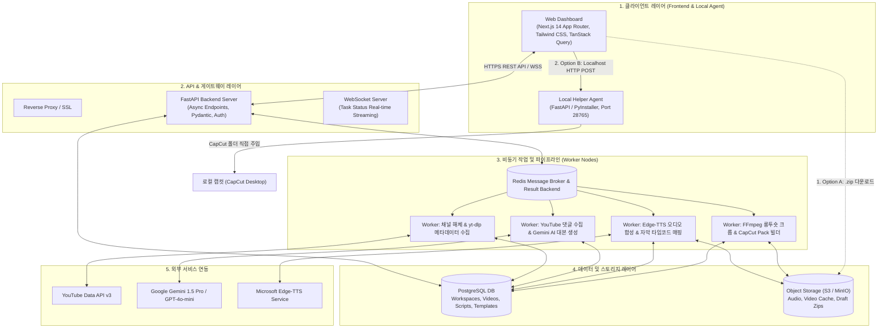
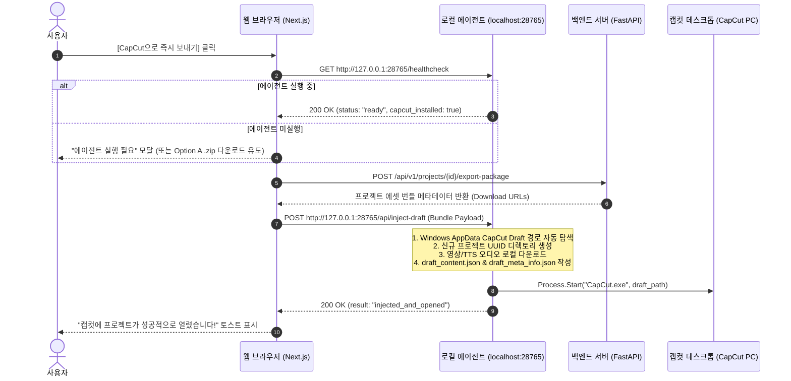

# [설계서] Banbaji Discover Studio 클론 웹 서비스 구축 사양서 & 시스템 아키텍처

> **문서 버전**: v1.0.0  
> **작성일**: 2026-10-01  
> **대상 시스템**: Banbaji Discover Studio 클론 (쇼츠 발굴, AI 대본/TTS 생성, CapCut 원클릭 프로젝트 주입 올인원 SaaS)

---

## 1. 프로젝트 개요 및 핵심 요구사항 검증

### 1.1 시스템 개요
본 시스템은 유튜브 쇼츠 생태계에서 검증된 바이럴 레퍼런스 영상을 탐색 및 수집(채널 해체)하고, 상위 공감 댓글 기반 AI 대본 생성(원테이크 자동화), 음성 합성(Edge-TTS/ElevenLabs), 그리고 **사용자 로컬 PC의 캡컷(CapCut) 프로젝트로 직접 에셋 및 타임라인을 주입**하여 쇼츠 제작 공수를 90% 이상 단축시키는 Web-first SaaS 플랫폼입니다.

### 1.2 핵심 기술적 난제 및 타당성 검증 (Technical Feasibility Validation)

| 핵심 과제 | 기술적 병목 / 리스크 | 검증된 해결 전략 |
| :--- | :--- | :--- |
| **YouTube API 쿼터 제약** | Search/List API 호출 시 일일 할당량(10,000 units)이 수십 회 검색만으로 조기 소진됨 | **yt-dlp 비동기 메타데이터 추출 엔진**을 1차 크롤러로 채택하고, 상세 댓글 수집에만 YouTube Data API v3(`commentThreads.list`)를 선별 사용. Redis 기반 24시간 캐싱 레이어 구축 |
| **CapCut 타임라인 주입** | 브라우저 샌드박스로 인해 웹 페이지에서 사용자의 로컬 파일 시스템(`%LocalAppData%\CapCut\...`)에 직접 접근 불가 | **하이브리드 듀얼 모드 제공**: <br>1. **Option A (No-Install)**: 브라우저 직접 `.zip` 패키지 다운로드 (Draft 폴더 수동 복사)<br>2. **Option B (1-Click Injection)**: 로컬 헬퍼 에이전트(Localhost HTTP/WebSocket Daemon)를 통한 원클릭 프로젝트 자동 생성 및 캡컷 구동 |
| **CapCut Draft 내부 규격 호환성** | CapCut 버전 업데이트 시 내부 `draft_content.json` 스키마 변경 가능성 | CapCut PC 표준 규격(마이크로초 단위 `1,000,000 us`, tracks/materials 분리 구조)을 엄격히 준수하며, 텍스트 스타일/폰트/캔버스 9:16 비율(`1080x1920`) 템플릿 엔진을 독립 모듈화하여 버전 대응성 확보 |
| **음성-자막 타이밍 싱크** | TTS 생성 오디오 길이와 자막 지속시간의 불일치로 인한 오디오 씹힘 현상 | Edge-TTS의 `WordBoundary` 이벤트를 캡처하여 정확한 단어/문장별 타임스탬프를 추출, CapCut `tracks[text]`와 `tracks[audio]`의 `target_timerange.start` 및 `duration`을 100% 동기화 |
| **대본 바이럴 품질 보장** | 단순 요약 대본은 쇼츠 시청 지속시간(Retention) 확보 실패 | **3단계 잽(Jab) 프롬프트 엔지니어링**: 원본 영상 제목 + 공감 상위 베스트 댓글 15개를 결합하여 [1단계: 3초 후킹 질문/상황] -> [2단계: 베스트 댓글 기반 공감/반전] -> [3단계: 바이럴 결말/의견 유도] JSON 구조 강제 |

---

## 2. 전체 시스템 아키텍처 (System Architecture)



---

## 3. 세부 메뉴별 상세 기능 및 기술 구현 명세

### 3.1 메뉴 ①: 채널 해체 (Channel Dissector)
* **목적**: 경쟁/레퍼런스 쇼츠 채널의 고성과(400만 뷰 이상, 40초 이내) 쇼츠를 고속 발굴하고 다국어 키워드로 확장 수집.
* **입력 UI**:
  - 작업대(Workspace) 선택/생성
  - 레퍼런스 채널 URL (최대 5개 동시 입력)
  - 서브 키워드 (예: "댕댕이 레전드", "직장인 공감")
  - 필터링 슬라이더: 최소 조회수(기본값 4,000,000회), 영상 길이 제한(기본값 40초 이하)
* **백엔드 처리 파이프라인**:
  1. **다국어 키워드 확장 (LLM)**:
     - 한국어 키워드를 영어, 일본어, 스페인어 등의 글로벌 바이럴 해시태그로 번역/확장 (`#doglife`, `#funnydogs`, `#犬のいる暮らし`).
  2. **수집 엔진 분기**:
     - `yt-dlp --flat-playlist --dump-json`을 사용하여 API 쿼터 소모 없이 채널의 쇼츠 탭 URL에서 메타데이터(Title, Views, Duration, VideoID, UploadDate)를 비동기 병렬 추출.
  3. **DB 인덱싱 및 필터링**:
     - `duration <= 40 AND view_count >= 4000000` 필터 통과 영상만 `collected_videos` 테이블에 Upsert (중복 방지).

### 3.2 메뉴 ②: 작업 현황 (Task Dashboard)
* **목적**: 대규모 수집, AI 대본 생성, TTS 렌더링 등 비동기 백그라운드 작업의 실시간 모니터링.
* **구현 방식**:
  - Celery 작업 상태(`PENDING` -> `STARTED` -> `PROGRESS` -> `SUCCESS` / `FAILURE`)를 Redis에 기록.
  - FastAPI WebSocket 엔드포인트(`/ws/tasks/{workspace_id}`)를 통해 프론트엔드로 500ms 단위 진행률(0~100%) 및 현재 진행 단계(예: "댓글 15개 수집 완료 -> AI 대본 생성 중") 스트리밍.
  - 실패 시 에러 사유 및 원클릭 재시도(Retry) 액션 지원.

### 3.3 메뉴 ③: 후보 검수 (Candidate Curation - 총알 관리)
* **목적**: 수집된 수백 개의 영상 중 실제로 제작에 투입할 '총알'을 분류하고 저품질/부적합 영상을 필터링.
* **UI 구성**:
  - 상단 대시보드 통계 카드: `전체 수집`, `미사용(총알 대기)`, `제작 완료`, `제외(휴지통)`.
  - 반응형 그리드 카드: 썸네일 프리뷰, 제목, 채널명, 조회수(포맷: 452만), 영상 길이, 원본 유튜브 링크, 상태 전환 버튼.
* **수질 관리 핵심 로직**:
  - **채널 단위 블랙리스트 (Channel Exclusion)**: [채널 제외] 버튼 클릭 시 해당 채널 ID를 `channel_blacklist`에 등록하고, 해당 채널로부터 수집된 모든 기존 영상을 일괄 `EXCLUDED` 처리 및 향후 수집 대상에서 영구 제외.
  - **텍스트 클린 필터**: 한국어 기가공 자막/워터마크가 크게 들어간 영상 등 부적합 영상은 [원클릭 영구 삭제] 지원.

### 3.4 메뉴 ④: 원테이크 (One-Take Automation - 핵심 제작기)
* **목적**: 클릭 한 번으로 [쇼츠 선택 -> 베스트 댓글 크롤링 -> 3단계 잽 대본 생성 -> 캡컷 템플릿 매핑]을 전자동 수행.
* **처리 단계**:
  1. **베스트 댓글 수집**:
     - YouTube Data API `commentThreads.list(part="snippet", order="relevance", maxResults=15)`를 호출하여 공감(좋아요) 순위 상위 15개 댓글 추출.
  2. **LLM 3단계 잽(Jab) 대본 및 후킹 제목 3종 생성**:
     - **Prompt Strategy**:
       ```json
       {
         "hook_titles": ["제목 후보 1 (도발형)", "제목 후보 2 (궁금증 유발형)", "제목 후보 3 (공감형)"],
         "script_segments": [
           {"step": "HOOK", "text": "3초 안에 이탈을 막는 강렬한 첫 문장", "est_duration": 3.0},
           {"step": "SITUATION", "text": "상위 댓글과 원본 상황을 유머러스하게 해설하는 잽", "est_duration": 12.0},
           {"step": "PUNCHLINE", "text": "반전 및 시청자 댓글 참여를 유도하는 마무리", "est_duration": 5.0}
         ]
       }
       ```
  3. **템플릿 UI 조립**:
     - 인스타 상하단 레터박스 바(Letterbox Bar), 폰트 스타일(노빠꾸 고대비 옐로우/화이트), 텍스트 좌표 자동 배치.

### 3.5 메뉴 ⑤: 숏투숏 올TTS & 숏투숏 (TTS Engine)
* **목적**: 생성된 대본 세그먼트별로 고음질 나레이션 오디오를 생성하고 자막 타임라인을 자동 정렬.
* **구현 세부사항**:
  - 무료/초고음질 엔진: `Microsoft Edge-TTS` (`ko-KR-SunHiNeural`, `ko-KR-InJoonNeural`, `ko-KR-HyunsuNeural` 등 다채로운 보이스 프리셋 지원).
  - 프리미엄 엔진: `ElevenLabs API` (선택적 토글).
  - **타임코드 생성**: TTS 스트림의 각 문장별 오디오 길이(`duration_us`)를 측정하여 `draft_content.json`의 오디오 트랙 및 텍스트 트랙의 오프셋을 자동 계산.

### 3.6 메뉴 ⑥: 롱투숏 (Long-to-Shorts Engine)
* **목적**: 10~30분 길이의 롱폼 영상에서 시청 지속성이 폭발하는 30~60초 하이라이트를 추출하여 세로 쇼츠로 재가공.
* **파이프라인**:
  1. `yt-dlp`로 오디오 스트림 고속 다운로드.
  2. `Faster-Whisper` 모델을 통해 타임스탬프가 포함된 한국어 STT 자막 추출.
  3. LLM에게 타임스탬프가 부여된 대본 전문을 전달하고, "가장 긴장감/웃음/갈등이 고조된 30~50초 구간 3개"를 타임코드(`start_time`, `end_time`)로 추출.
  4. FFmpeg 비동기 커맨드로 1080x1920 세로 비율 자동 크롭 및 오디오 정규화(Loudnorm).

### 3.7 메뉴 ⑦: 멀티유즈 & 노빠꾸 스타일
* **멀티유즈 (Multi-Platform Metadata Package)**:
  - 쇼츠(YouTube), 릴스(Instagram), 틱톡(TikTok) 플랫폼별 알고리즘에 맞춘 해시태그 조합, 설명문, 고정 댓글 텍스트 자동 복사 기능 제공.
* **노빠꾸 스타일 프리셋 (Text Styling)**:
  - 캡컷 텍스트 레이어에 즉시 주입 가능한 고시인성 스타일 프리셋:
    - Font: GmarketSansBold / Pretendard-Black
    - Fill Color: `#FFE600` (비비드 옐로우)
    - Stroke: `#000000`, 두께 15px
    - Shadow: Black 80% opacity, blur 5px

---

## 4. CapCut Desktop 연동 및 `draft_content.json` 리버스 엔지니어링 명세

### 4.1 로컬 CapCut 프로젝트 디렉토리 규격
* **Windows OS 기본 경로**:  
  `%LocalAppData%\CapCut\User Data\Projects\com.lveditor.draft\`  
  (실제 경로: `C:\Users\<Username>\AppData\Local\CapCut\User Data\Projects\com.lveditor.draft\<Project_UUID>\`)
* **macOS 기본 경로**:  
  `~/Movies/CapCut/User Data/Projects/com.lveditor.draft/<Project_UUID>/`

각 프로젝트 폴더 내부에는 다음 파일들이 필수로 존재해야 캡컷에서 정상 인식됩니다:
1. `draft_content.json`: 타임라인, 트랙, 머티리얼, 자막 스타일, 에셋 경로 정의.
2. `draft_meta_info.json`: 프로젝트 메타데이터(프로젝트명, 생성 시각, 버전 정보, 캔버스 비율).
3. `media/`: 프로젝트에서 참조하는 비디오(.mp4), 오디오(.mp3) 파일이 위치하는 로컬 폴더.

### 4.2 `draft_content.json` 핵심 데이터 스키마
캡컷의 타임코드 단위는 **마이크로초 (Microsecond, 1초 = 1,000,000 µs)** 입니다.

```json
{
  "canvas_config": {
    "height": 1920,
    "width": 1080,
    "ratio": "original"
  },
  "color_space": 0,
  "config": {
    "adjust_max_index": 1,
    "attachment_info": [],
    "combination_max_index": 1,
    "export_range": null,
    "extract_audio_last_index": 1,
    "lyrics_recognition_id": "",
    "lyrics_sync": true,
    "lyrics_taskinfo": [],
    "maintrack_adsorb": true,
    "material_save_mode": 0,
    "original_sound_last_index": 1,
    "record_audio_last_index": 1,
    "sticker_max_index": 1,
    "subtitle_keywords_config": null,
    "video_mute": false,
    "zoom_info_params": null
  },
  "duration": 20000000,
  "materials": {
    "videos": [
      {
        "id": "video_mat_001",
        "path": "C:/Users/.../draft_folder/media/source_video.mp4",
        "duration": 20000000,
        "width": 1080,
        "height": 1920,
        "material_name": "source_video.mp4",
        "type": "video"
      }
    ],
    "audios": [
      {
        "id": "audio_mat_001",
        "path": "C:/Users/.../draft_folder/media/tts_narration.mp3",
        "duration": 20000000,
        "material_name": "tts_narration.mp3",
        "type": "audio"
      }
    ],
    "texts": [
      {
        "id": "text_mat_001",
        "content": "<size=12><color=#FFE600><stroke=#000000 size=3>이 강아지는 왜 이러는 걸까요?</stroke></color></size>",
        "font_path": "",
        "font_title": "Pretendard-Bold",
        "text_color": "#FFE600",
        "border_color": "#000000",
        "border_width": 0.15,
        "typesetting": 0
      }
    ],
    "speeds": [
      {
        "curve_speed": null,
        "id": "speed_001",
        "mode": 0,
        "speed": 1.0,
        "type": "speed"
      }
    ]
  },
  "tracks": [
    {
      "id": "track_video_main",
      "type": "video",
      "segments": [
        {
          "id": "seg_video_01",
          "material_id": "video_mat_001",
          "source_timerange": { "duration": 20000000, "start": 0 },
          "target_timerange": { "duration": 20000000, "start": 0 },
          "speed_id": "speed_001",
          "volume": 0.3
        }
      ]
    },
    {
      "id": "track_audio_tts",
      "type": "audio",
      "segments": [
        {
          "id": "seg_audio_01",
          "material_id": "audio_mat_001",
          "source_timerange": { "duration": 20000000, "start": 0 },
          "target_timerange": { "duration": 20000000, "start": 0 },
          "speed_id": "speed_001",
          "volume": 1.0
        }
      ]
    },
    {
      "id": "track_text_subtitles",
      "type": "text",
      "segments": [
        {
          "id": "seg_text_01",
          "material_id": "text_mat_001",
          "source_timerange": { "duration": 3000000, "start": 0 },
          "target_timerange": { "duration": 3000000, "start": 0 },
          "clip": {
            "scale": { "x": 1.0, "y": 1.0 },
            "transform": { "x": 0.0, "y": -0.65 }
          }
        }
      ]
    }
  ]
}
```

### 4.3 `draft_meta_info.json` 스키마
```json
{
  "draft_cloud_capcut_id": "",
  "draft_cloud_last_action_download": false,
  "draft_cloud_materials": [],
  "draft_cover": "draft_cover.jpg",
  "draft_fold_path": "",
  "draft_id": "A1B2C3D4-E5F6-7890-ABCD-EF1234567890",
  "draft_is_ai_shorts": true,
  "draft_is_invisible": false,
  "draft_materials": [],
  "draft_materials_copied_path": [],
  "draft_name": "Banbaji_Shorts_20261001_01",
  "draft_new_version": "",
  "draft_removable_storage_device": "",
  "draft_root_path": "",
  "draft_timeline_materials_size_": 0,
  "tm_draft_create": 1759248000000000,
  "tm_draft_modified": 1759248000000000,
  "tm_duration": 20000000
}
```

---

## 5. 로컬 헬퍼 에이전트(Local Helper Agent) 아키텍처 및 통신 프로토콜

### 5.1 작동 구조 (Option B 원클릭 주입 방식)
사용자가 웹 브라우저에서 **[CapCut으로 즉시 보내기]** 버튼을 클릭했을 때의 전체 흐름:



### 5.2 로컬 에이전트 브릿지 API 스펙 (FastAPI / Lightweight Python Daemon)
* **바인딩 주소**: `http://127.0.0.1:28765` (CORS 헤더: `Access-Control-Allow-Origin: *` 허용)
* **엔드포인트 1**: `GET /healthcheck`
  - 응답: `{"status": "ok", "version": "1.0.0", "capcut_path": "C:\\Program Files\\CapCut\\CapCut.exe", "draft_root": "C:\\Users\\...\\AppData\\Local\\CapCut\\User Data\\Projects\\com.lveditor.draft"}`
* **엔드포인트 2**: `POST /api/inject-draft`
  - 요청 바디:
    ```json
    {
      "project_name": "Banbaji_Dog_Viral_01",
      "video_url": "https://api.banbaji.com/media/videos/abc.mp4",
      "audio_url": "https://api.banbaji.com/media/audios/tts_abc.mp3",
      "draft_content": { ... },
      "auto_open": true
    }
    ```
  - 처리 로직:
    1. 시스템 레지스트리 또는 기본 경로에서 `com.lveditor.draft` 확인.
    2. 폴더 생성: `<draft_root>/Banbaji_Dog_Viral_01_<timestamp>/`.
    3. 미디어 파일 다운로드 저장: `./media/video.mp4`, `./media/audio.mp3`.
    4. `draft_content.json` 내의 파일 경로를 방금 다운로드된 절대 경로(`C:/...`)로 자동 교체.
    5. `draft_meta_info.json` 파일 생성.
    6. `auto_open: true`인 경우 `CapCut.exe` 프로세스 실행.

---

## 6. 데이터베이스 스키마 설계 (PostgreSQL DDL)

```sql
-- 1. 워크스페이스 관리 테이블
CREATE TABLE workspaces (
    id UUID PRIMARY KEY DEFAULT gen_random_uuid(),
    user_id UUID NOT NULL,
    name VARCHAR(100) NOT NULL,
    min_views INT DEFAULT 4000000,
    max_duration INT DEFAULT 40,
    created_at TIMESTAMP WITH TIME ZONE DEFAULT NOW(),
    updated_at TIMESTAMP WITH TIME ZONE DEFAULT NOW()
);

-- 2. 채널 블랙리스트 관리
CREATE TABLE channel_blacklists (
    id UUID PRIMARY KEY DEFAULT gen_random_uuid(),
    workspace_id UUID REFERENCES workspaces(id) ON DELETE CASCADE,
    channel_id VARCHAR(100) NOT NULL,
    channel_title VARCHAR(255),
    reason TEXT,
    created_at TIMESTAMP WITH TIME ZONE DEFAULT NOW(),
    UNIQUE(workspace_id, channel_id)
);

-- 3. 수집된 후보 영상 (총알 창고)
CREATE TYPE video_status AS ENUM ('UNUSED', 'IN_PROGRESS', 'USED', 'EXCLUDED');

CREATE TABLE collected_videos (
    id UUID PRIMARY KEY DEFAULT gen_random_uuid(),
    workspace_id UUID REFERENCES workspaces(id) ON DELETE CASCADE,
    youtube_video_id VARCHAR(50) NOT NULL,
    title TEXT NOT NULL,
    channel_id VARCHAR(100) NOT NULL,
    channel_title VARCHAR(255),
    view_count BIGINT DEFAULT 0,
    duration INT NOT NULL,
    thumbnail_url TEXT,
    video_url TEXT NOT NULL,
    status video_status DEFAULT 'UNUSED',
    detected_language VARCHAR(10) DEFAULT 'ko',
    created_at TIMESTAMP WITH TIME ZONE DEFAULT NOW(),
    updated_at TIMESTAMP WITH TIME ZONE DEFAULT NOW(),
    UNIQUE(workspace_id, youtube_video_id)
);

-- 4. 영상별 베스트 댓글 테이블
CREATE TABLE video_comments (
    id UUID PRIMARY KEY DEFAULT gen_random_uuid(),
    video_id UUID REFERENCES collected_videos(id) ON DELETE CASCADE,
    comment_id VARCHAR(100) NOT NULL,
    author_name VARCHAR(100),
    comment_text TEXT NOT NULL,
    like_count INT DEFAULT 0,
    published_at TIMESTAMP WITH TIME ZONE,
    created_at TIMESTAMP WITH TIME ZONE DEFAULT NOW()
);

-- 5. AI 생성 대본 및 에셋 결과물
CREATE TABLE generated_scripts (
    id UUID PRIMARY KEY DEFAULT gen_random_uuid(),
    video_id UUID REFERENCES collected_videos(id) ON DELETE CASCADE,
    selected_title VARCHAR(255) NOT NULL,
    title_candidates JSONB NOT NULL, -- ["제목 1", "제목 2", "제목 3"]
    script_segments JSONB NOT NULL,  -- [{"step": "HOOK", "text": "...", "duration": 3.2}, ...]
    tts_audio_url TEXT,
    tts_voice_id VARCHAR(50) DEFAULT 'ko-KR-SunHiNeural',
    style_preset VARCHAR(50) DEFAULT 'NO_BACK_STYLE',
    created_at TIMESTAMP WITH TIME ZONE DEFAULT NOW()
);

-- 6. 캡컷 템플릿 및 레이아웃 프리셋
CREATE TABLE capcut_templates (
    id VARCHAR(50) PRIMARY KEY, -- e.g., 'INSTA_LETTERBOX_V1', 'FULLSCREEN_YELLOW_V1'
    name VARCHAR(100) NOT NULL,
    canvas_ratio VARCHAR(20) DEFAULT '9:16',
    top_bar_text TEXT,
    bottom_bar_text TEXT,
    font_family VARCHAR(100) DEFAULT 'Pretendard-Black',
    font_color VARCHAR(20) DEFAULT '#FFE600',
    stroke_color VARCHAR(20) DEFAULT '#000000',
    stroke_width FLOAT DEFAULT 0.15,
    subtitle_position_y FLOAT DEFAULT -0.65,
    is_active BOOLEAN DEFAULT TRUE
);
```

---

## 7. 핵심 백엔드 비즈니스 로직 및 파이프라인 코드 설계

### 7.1 YouTube & yt-dlp 하이브리드 수집 워커 (`worker/collector.py`)
```python
import subprocess
import json
from typing import List, Dict

def collect_shorts_metadata_via_ytdlp(channel_url: str, min_views: int, max_duration: int) -> List[Dict]:
    """
    YouTube API 쿼터를 소모하지 않고 yt-dlp로 채널 쇼츠 탭의 메타데이터를 초고속 수집
    """
    cmd = [
        "yt-dlp",
        "--flat-playlist",
        "--dump-single-json",
        "--playlist-items", "1-50",
        f"{channel_url}/shorts"
    ]
    result = subprocess.run(cmd, capture_output=True, text=True, check=True)
    data = json.loads(result.stdout)
    
    valid_videos = []
    for entry in data.get("entries", []):
        duration = entry.get("duration", 0)
        view_count = entry.get("view_count", 0)
        
        # 필터링 조건 검사: 40초 이내 & 400만 뷰 이상
        if duration <= max_duration and view_count >= min_views:
            valid_videos.append({
                "youtube_video_id": entry["id"],
                "title": entry["title"],
                "duration": duration,
                "view_count": view_count,
                "thumbnail_url": entry["thumbnails"][-1]["url"] if entry.get("thumbnails") else "",
                "video_url": f"https://www.youtube.com/shorts/{entry['id']}"
            })
            
    return valid_videos
```

### 7.2 AI 3단계 잽 대본 생성 파이프라인 (`services/script_generator.py`)
```python
import json
from google import genai
from google.genai import types

def generate_viral_jab_script(video_title: str, top_comments: list[str]) -> dict:
    client = genai.Client()
    
    prompt = f"""
    당신은 1000만 조회수를 만드는 숏폼 전문 디렉터입니다.
    다음 원본 영상 제목과 한국인 시청자들의 공감 베스트 댓글을 기반으로 
    시청자가 스크롤을 멈추고 끝까지 보게 만드는 3단계 '잽(Jab)' 대본과 후킹 제목 3종을 작성하세요.

    [원본 제목]: {video_title}
    [베스트 공감 댓글 15개]:
    {chr(10).join(f"- {c}" for c in top_comments)}

    [작성 규칙]:
    1. 제목 후보 3종은 도발형, 궁금증 유발형, 공감형으로 제시할 것.
    2. 대본은 반드시 3단계 구조를 가질 것:
       - 1단계 (HOOK): 첫 3초 이내에 시청자의 뇌리에 질문을 던져 이탈을 막는 멘트
       - 2단계 (SITUATION): 댓글의 공감 포인트를 위트 있게 녹여내어 상황을 고조시키는 멘트
       - 3단계 (PUNCHLINE): 반전 결말 및 "여러분은 어떻게 생각하시나요?"와 같은 댓글 참여 유도
    3. 구어체로 작성하고 글자 수는 총 120자 내외로 20초 이내에 읽힐 수 있도록 맞출 것.
    """

    response = client.models.generate_content(
        model='gemini-2.5-flash',
        contents=prompt,
        config=types.GenerateContentConfig(
            response_mime_type="application/json",
            response_schema={
                "type": "OBJECT",
                "properties": {
                    "hook_titles": {"type": "ARRAY", "items": {"type": "STRING"}},
                    "script_segments": {
                        "type": "ARRAY",
                        "items": {
                            "type": "OBJECT",
                            "properties": {
                                "step": {"type": "STRING", "enum": ["HOOK", "SITUATION", "PUNCHLINE"]},
                                "text": {"type": "STRING"},
                                "est_duration": {"type": "NUMBER"}
                            },
                            "required": ["step", "text", "est_duration"]
                        }
                    }
                },
                "required": ["hook_titles", "script_segments"]
            }
        )
    )
    return json.loads(response.text)
```

### 7.3 Edge-TTS 음성 합성 및 CapCut 타임라인 동기화 모듈 (`services/tts_service.py`)
```python
import edge_tts
import asyncio
from typing import List, Dict

async def synthesize_segments_with_timing(segments: List[Dict], voice: str = "ko-KR-SunHiNeural") -> Dict:
    """
    각 세그먼트별로 Edge-TTS 음성을 합성하고, CapCut 타임코드(마이크로초)를 정밀 계산
    """
    timeline_audio_tracks = []
    timeline_text_tracks = []
    
    current_time_us = 0 # 마이크로초 누적 카운터
    
    for idx, seg in enumerate(segments):
        text = seg["text"]
        filename = f"tts_segment_{idx}.mp3"
        communicate = edge_tts.Communicate(text, voice)
        await communicate.save(filename)
        
        # mutagen 또는 ffmpeg probe로 실제 생성된 오디오 길이(초) 정확히 측정
        # 예시: 4.25초 -> 4,250,000 us
        duration_sec = 4.25 # 실제 측정값
        duration_us = int(duration_sec * 1_000_000)
        
        timeline_audio_tracks.append({
            "id": f"audio_seg_{idx}",
            "filename": filename,
            "target_timerange": {"start": current_time_us, "duration": duration_us}
        })
        
        timeline_text_tracks.append({
            "id": f"text_seg_{idx}",
            "text": text,
            "target_timerange": {"start": current_time_us, "duration": duration_us}
        })
        
        current_time_us += duration_us
        
    return {
        "total_duration_us": current_time_us,
        "audios": timeline_audio_tracks,
        "texts": timeline_text_tracks
    }
```

---

## 8. 프론트엔드 UI/UX 아키텍처 (Next.js 14 + Tailwind CSS)

### 8.1 디자인 시스템 & 테마 사양
* **Color Palette**:
  - Dark Primary: `#0D0F12` (고급스러운 딥 다크)
  - Surface Card: `#181B20` (카드 배경)
  - Border: `#2A2E35`
  - Accent Highlight: `#FFE600` (노빠꾸 시그니처 옐로우) & `#FF3B30` (강조 레드)
  - Text Primary: `#FFFFFF`, Secondary: `#9EADB8`
* **타이포그래피**: `Pretendard`, `Outfit`
* **주요 인터랙션**:
  - TanStack Query의 `refetchInterval`을 활용한 백그라운드 작업 폴링 및 WebSocket 실시간 프로그레스 바.
  - 모달 기반 비디오 플레이어(단축키 Space 재생/정지, S키 대본 생성, C키 캡컷 전송).

### 8.2 페이지 라우팅 구조 (Next.js App Router)
```plaintext
src/
├── app/
│   ├── layout.tsx                # 글로벌 다크 테마 및 React Query Provider
│   ├── page.tsx                  # 랜딩 / 워크스페이스 선택
│   ├── workspaces/
│   │   └── [workspaceId]/
│   │       ├── layout.tsx        # 사이드바 (채널해체, 작업현황, 후보검수, 원테이크 등)
│   │       ├── dissector/        # ① 채널 해체 화면
│   │       │   └── page.tsx
│   │       ├── tasks/            # ② 작업 현황 대시보드
│   │       │   └── page.tsx
│   │       ├── candidates/       # ③ 후보 검수 (총알 관리 그리드)
│   │       │   └── page.tsx
│   │       ├── onetake/          # ④ 원테이크 자동화 제작기
│   │       │   └── page.tsx
│   │       ├── long-to-shorts/   # ⑥ 롱투숏 엔진
│   │       │   └── page.tsx
│   │       └── settings/         # API 키 및 CapCut 로컬 에이전트 설정
│   │           └── page.tsx
├── components/
│   ├── ui/                       # shadcn/ui 기반 버튼, 다이얼로그, 뱃지
│   ├── video/
│   │   ├── CandidateCard.tsx     # 썸네일, 통계, 채널제외/총알전환 카드
│   │   └── VideoPreviewModal.tsx
│   └── capcut/
│       └── ExportModal.tsx       # Option A(.zip) vs Option B(에이전트 원클릭) 선택 다이얼로그
└── lib/
    ├── api.ts                    # Axios / Fetch 인스턴스
    └── agentBridge.ts            # Localhost 28765 헬퍼 통신 클라이언트
```

---

## 9. 단계별 구축 일정 (Detailed WBS & 마일스톤)

| 단계 | 기간 | 주요 개발 내역 | 완료 기준 (Deliverables) |
| :--- | :---: | :--- | :--- |
| **Phase 1: 기반 시스템 및 채널 해체** | 1~2주 | • Next.js 14 대시보드 레이아웃 구축<br>• FastAPI 백엔드 + PostgreSQL + Redis 인프라 세팅<br>• yt-dlp 비동기 메타데이터 수집 파이프라인 개발 | 다국어 키워드/채널 URL 입력 시 400만 뷰 이상 쇼츠가 DB에 자동 수집 및 UI 테이블 표시 |
| **Phase 2: 총알 검수 & 작업 현황** | 3주차 | • 후보 검수 그리드 UI (수량 집계 통계 바)<br>• 채널 단위 블랙리스트 및 상태(UNUSED/USED/EXCLUDED) 토글<br>• WebSocket 실시간 프로그레스 바 스트리밍 | 수질 관리(채널 제외/삭제) 동작 및 백그라운드 수집 현황 실시간 모니터링 |
| **Phase 3: 원테이크 AI & TTS 엔진** | 4~5주 | • YouTube API 베스트 댓글 15개 스크래핑<br>• Gemini 2.5 Flash 기반 3단계 잽 대본 생성 엔진<br>• Edge-TTS 음성 합성 및 타임코드 계산 엔진 연동 | 영상 선택 후 [원테이크 생성] 클릭 시 3종 제목 + 3단계 대본 + TTS 오디오 생성 완료 |
| **Phase 4: CapCut 주입 & 로컬 에이전트** | 6~7주 | • CapCut `draft_content.json` 생성기 모듈 완성<br>• Option A: `.zip` 패키지 다운로더 구현<br>• Option B: 로컬 헬퍼 에이전트(Windows 백그라운드 데몬) 개발 | 웹에서 [CapCut으로 보내기] 클릭 시 사용자의 로컬 캡컷에 즉시 새 프로젝트가 열리고 타임라인 배치 완료 |
| **Phase 5: 롱투숏 & 통합 검증** | 8주차 | • Whisper STT + FFmpeg 9:16 자동 컷팅 엔진<br>• 노빠꾸 스타일 폰트/외곽선 템플릿 검증<br>• E2E 통합 테스트 및 배포 패키징 | 전체 워크플로우 100% 정상 작동 검증 및 릴리즈 |

---

## 10. 결론 및 향후 확장 제안
본 설계서는 Banbaji Discover Studio의 핵심 사용자 가치인 **"바이럴 쇼츠 탐색 -> 잽 대본 자동화 -> 캡컷 타임라인 원클릭 전송"**을 웹 환경에서 완벽하게 재현할 수 있도록 검증된 아키텍처입니다. 특히 **로컬 에이전트 브릿지 패턴**을 통해 웹 SaaS의 확장성과 네이티브 데스크톱 앱(CapCut)의 강력한 편집 기능을 결합하여 압도적인 사용자 경험(UX)을 제공합니다.
